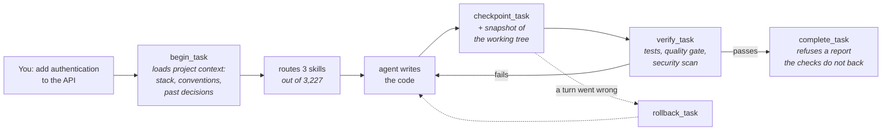
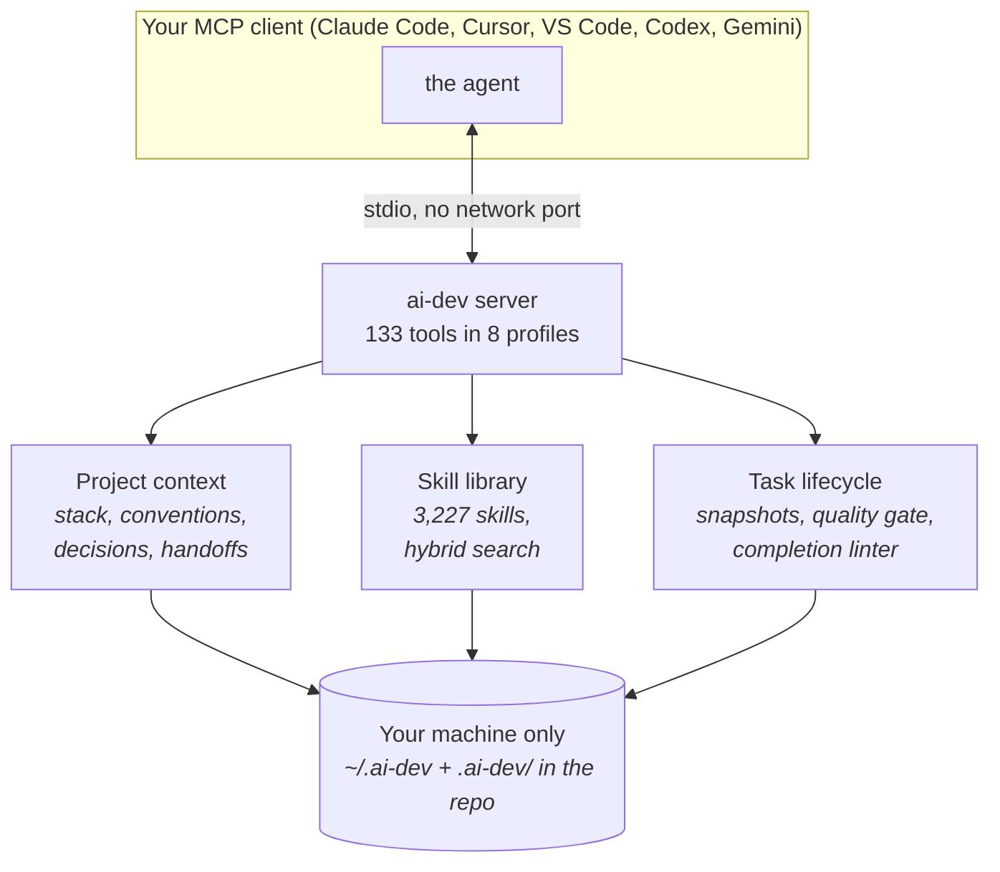

# AI Dev System

> 🇬🇧 English (this page) · 🇷🇺 Русская версия: [README.ru.md](README.ru.md)

**A local layer for AI coding agents: durable memory of your project, the skills a
task actually needs, a controlled task lifecycle, and a completion the agent has
to prove.**

It runs on your machine over `stdio` — no network port, no remote server, no
account. You point an MCP client you already use (Claude Code, Claude Desktop,
Cursor, VS Code, Codex, Gemini) at it, and the agent in that client gains the
four things below.

---

## The problem

A coding agent is capable and forgetful. Every session it:

- **starts from zero** — it has no memory of your architecture, your conventions,
  or the decision you made last week, so you re-explain the project each time;
- **guesses its approach**, because nothing routes it from "add authentication"
  to the knowledge that applies to authentication;
- **works without a shape** — no explicit start, no checkpoints, no way back when
  a turn goes wrong;
- **and then tells you it is finished.** *"Should work."* *"Pre-existing issue."*
  *"Skipping tests for now."*

The last one is the expensive one. A finished task and a confident sentence look
identical, and you find out which you got later.

## What happens after you install it

One task, start to finish. This is the whole product:



Four things the agent could not do before:

| | |
| --- | --- |
| 🧠 **It remembers the project** | `begin_task` compiles a context pack: the stack, the conventions, the architectural decisions on record, the handoff from the last session, and the instincts learned across sessions. You stop re-explaining. |
| 🎯 **It finds the knowledge that applies** | Hybrid search (keyword + sparse + optional local BGE-M3) routes the request to at most three skills out of 3,227 — enough to be useful, few enough to stay in context. |
| 🔒 **It works inside a lifecycle** | Begin, checkpoint, verify, complete. Every checkpoint snapshots the working tree, so any turn can be undone without touching your branch, stash or index. |
| ✅ **It cannot just say it is done** | `complete_task` lints the completion report against the checks that actually ran. "Should work", "pre-existing issue", "skipping tests for now" come back refused, with the rule and what is missing. |

**→ [Watch it run on a real task](docs/DEMO.md)** — "add authentication to the API",
scene by scene, including the verification failure and the fix.

## Install

**Locally, from a clone** — Node.js 22.12+ and nothing else:

```bash
cd ai-dev-mcp-server
npm ci --ignore-scripts --no-audit --no-fund
npm run setup
```

Then point your MCP client at `ai-dev-mcp-server/src/server.mjs` and restart it.
That is the whole install, and it is the path to take on your own machine: the
local dense model is one flag here (`npm run setup -- --dense`) and a custom
image build in the packaged path.

**Packaged, through Docker** — for a machine that should not hold a personal
vault, or a team that wants one image everybody runs the same way:

| | |
| --- | --- |
| Windows | `powershell.exe -NoProfile -ExecutionPolicy Bypass -File .\bootstrap.ps1` |
| macOS / Linux | `sh ./bootstrap.sh` (add `--install-prerequisites` if Docker is missing) |

Every client's configuration block, Compose, the local model in a container,
Arch/AUR, Homebrew, and what to do when it does not work:
**[docs/INSTALL.md](docs/INSTALL.md)**.

## Your first task

Open a repository in your client and say:

```text
Use the ai-dev MCP server. Begin a task for /workspace/my-project:
add CSV export for the report, cover the change with tests, and run verify_task.
```

What you should see: the agent calls `begin_task`, reports the context it
compiled and the skills it routed, writes the code, checkpoints, runs
`verify_task`, and only then closes the task — with a pull request description
written from the evidence into `.ai-dev/pr/<task_id>.md`.

If it tries to close early, it will not be allowed to. That is the point.

## What you get

The server exposes 133 tools. You do not need to know them — they are grouped
into eight **capability profiles**, and only `core` is on the critical path:

| Profile | Tools | What it adds |
| --- | --- | --- |
| **`core`** | 25 | Project context, skill routing, and a task from first command to verified completion. *Always on.* |
| `coding` | 18 | Epics, the plan gate, project cards, and the repository's own engineering rules. |
| `memory` | 16 | Decisions, session handoffs, and instincts learned across sessions. |
| `git` | 9 | Isolated worktrees, snapshots and rollback, diff review, pull request text. |
| `frontend` | 13 | Brief, visual directions, design system, references. |
| `qa` | 8 | Playwright and visual QA, and the benchmarks that hold search and routing honest. |
| `security` | 8 | Secret and dependency scans, command and write policy, MCP inventory. |
| `advanced` | 36 | Diagrams, the search and skill indexes, the dashboard, usage, packaging. |

Set `AI_DEV_PROFILES=core,git` and the server advertises 34 tools instead of 133
— about 15 KB of schema in the model's context instead of 96 KB, before it has
read a word of your request. Unset, everything is on and nothing is hidden.

**[docs/CAPABILITIES.md](docs/CAPABILITIES.md)** — what each profile carries and
when to turn it on.

## How it works



Everything is local and readable: project state lives in `.ai-dev/` inside the
repository (reviewable in a pull request), personal memory in `~/.ai-dev/`. The
Docker image carries no vault, tokens, projects, or task history, and the
container runs with no network, no capabilities, and a read-only root filesystem.

## Documentation

| | |
| --- | --- |
| [**Demo**](docs/DEMO.md) | One real task end to end, including the failure and the fix. |
| [**Install**](docs/INSTALL.md) | Every platform, every client, Docker, packaging, diagnostics. |
| [**Workflow**](docs/WORKFLOW.md) | The task lifecycle, epics, undoing a turn, memory and learning. |
| [**Capabilities**](docs/CAPABILITIES.md) | The eight profiles and how to narrow the tool surface. |
| [**Guard rails**](docs/GUARDRAILS.md) | Agent hooks, policy rules, MCP inventory, local data and security. |
| [**Tool reference**](ai-dev-mcp-server/docs/TOOLS.md) | All 133 tools, generated from the server itself. |
| [**Architecture**](ai-dev-mcp-server/docs/ARCHITECTURE.md) | How the server is put together. |
| [**Changelog**](CHANGELOG.md) | What changed, and what to re-check after upgrading. |

## Contributing

See [CONTRIBUTING.md](CONTRIBUTING.md) for the development workflow, how the test
suite is split between a standalone checkout and a full vault, and the checks CI
runs. Working through an AI agent? [AGENTS.md](AGENTS.md) holds the rules an
agent gets wrong on this repository.

Participation is governed by the [Code of Conduct](CODE_OF_CONDUCT.md).
Security reports: [SECURITY.md](SECURITY.md).

## Licences

This project is MIT — see [LICENSE](LICENSE).

The bundled skill catalogue is imported work, not written here. Every source is
MIT, ships its licence text beside its own files under
`docker/public-seed/03-skills-catalog/sources/`, and is recorded in
[THIRD_PARTY_NOTICES.md](THIRD_PARTY_NOTICES.md) with the revision that was
imported: [Membrane application-skills](https://github.com/membranedev/application-skills)
(3,074), [ECC — Everything Claude Code](THIRD_PARTY_NOTICES.md) (101),
[Understand Anything](https://github.com/Egonex-AI/Understand-Anything) (9),
[mattpocock/skills](https://github.com/mattpocock/skills) (1), and the
taste-skill, ui-ux-pro-max and Archify design and diagram tooling.
