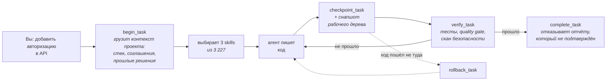
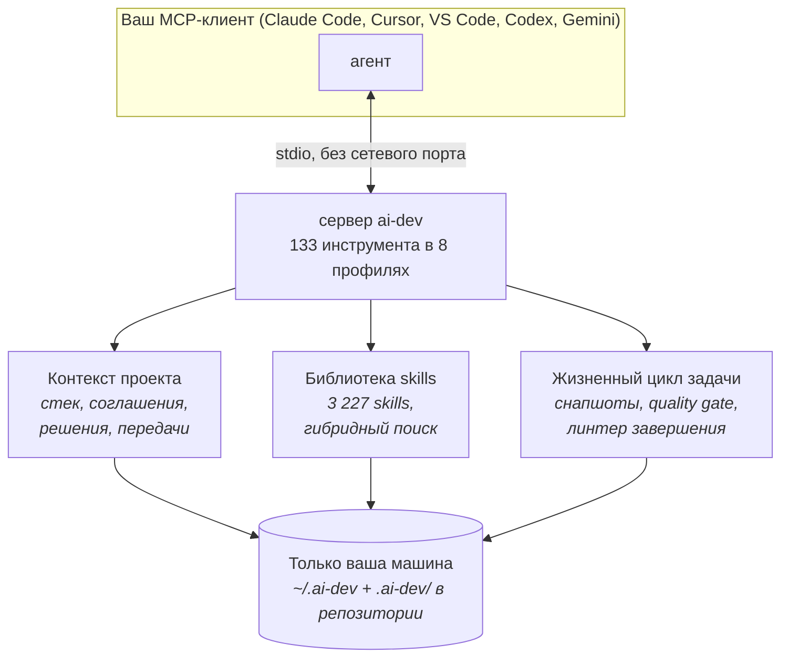

# AI Dev System

> 🇷🇺 Русский (эта страница) · 🇬🇧 English version: [README.md](README.md)

**Локальный слой для AI coding agents: постоянная память о проекте, нужные для
задачи skills, контролируемый жизненный цикл работы и завершение, которое агент
обязан доказать.**

Работает на вашей машине по `stdio` — без сетевого порта, без удалённого сервера,
без аккаунта. Вы направляете на него MCP-клиент, которым и так пользуетесь
(Claude Code, Claude Desktop, Cursor, VS Code, Codex, Gemini), и агент в этом
клиенте получает четыре вещи, описанные ниже.

---

## Проблема

Coding-агент способный и беспамятный. В каждой сессии он:

- **начинает с нуля** — не помнит вашу архитектуру, ваши соглашения и решение,
  принятое на прошлой неделе, поэтому проект приходится объяснять заново;
- **угадывает подход**, потому что ничто не ведёт его от «добавить авторизацию»
  к знаниям, которые к авторизации относятся;
- **работает без формы** — нет явного начала, нет чекпоинтов, нет пути назад,
  когда ход пошёл не туда;
- **и сообщает, что закончил.** *«Должно работать».* *«Это pre-existing issue».*
  *«Тесты пока пропустим».*

Дорого обходится последнее. Сделанная задача и уверенная фраза выглядят
одинаково, а что из этого вам досталось — выясняется позже.

## Что происходит после установки

Одна задача от начала до конца. Это и есть весь продукт:



Четыре вещи, которых агент раньше не умел:

| | |
| --- | --- |
| 🧠 **Он помнит проект** | `begin_task` компилирует пакет контекста: стек, соглашения, записанные архитектурные решения, передачу из прошлой сессии и инстинкты, накопленные между сессиями. Объяснять заново не нужно. |
| 🎯 **Он находит подходящие знания** | Гибридный поиск (ключевые слова + sparse + опциональная локальная BGE-M3) направляет запрос максимум к трём skills из 3 227 — достаточно, чтобы помочь, и мало, чтобы уместиться в контекст. |
| 🔒 **Он работает внутри жизненного цикла** | Начать, зачекпоинтить, проверить, завершить. Каждый чекпоинт снимает снапшот рабочего дерева, поэтому любой ход можно отменить, не трогая ветку, stash и индекс. |
| ✅ **Он не может просто заявить, что закончил** | `complete_task` сверяет отчёт с проверками, которые действительно выполнялись. «Должно работать», «pre-existing issue», «тесты пока пропустим» возвращаются отказом с названием правила и тем, чего не хватает. |

**→ [Посмотреть на настоящей задаче](docs/ru/DEMO.md)** — «добавить авторизацию в
API», по шагам, включая падение проверки и исправление.

## Установка

**Локально, из клона** — нужен Node.js 22.12+ и больше ничего:

```bash
cd ai-dev-mcp-server
npm ci --ignore-scripts --no-audit --no-fund
npm run setup
```

Затем направьте MCP-клиент на `ai-dev-mcp-server/src/server.mjs` и перезапустите
его. Это вся установка, и на своей машине стоит идти именно этим путём.
Локальная dense-модель здесь — один флаг: `npm run setup -- --dense` скачивает
пиннутый ONNX-экспорт BGE-M3 со сверкой sha256 и запускает его в Node, так что
«и больше ничего» верно и для неё; `npm run dense:doctor` скажет, получилось ли.
В упакованном варианте веса монтируются.

**В контейнере, через Docker** — для машины, на которой не должно быть личного
vault, или для команды, которой нужен один образ на всех:

| | |
| --- | --- |
| Windows | `powershell.exe -NoProfile -ExecutionPolicy Bypass -File .\bootstrap.ps1` |
| macOS / Linux | `sh ./bootstrap.sh` (добавьте `--install-prerequisites`, если нет Docker) |

Блоки конфигурации для каждого клиента, Compose, локальная модель в контейнере,
Arch/AUR, Homebrew и что делать, если не заработало:
**[docs/ru/INSTALL.md](docs/ru/INSTALL.md)**.

## Первая задача

Откройте репозиторий в клиенте и скажите:

```text
Используй MCP-сервер ai-dev. Начни задачу для /workspace/my-project:
добавь экспорт отчёта в CSV, покрой изменение тестами и выполни verify_task.
```

Что вы должны увидеть: агент вызывает `begin_task`, показывает собранный контекст
и выбранные skills, пишет код, ставит чекпоинт, запускает `verify_task` и только
после этого закрывает задачу — с описанием pull request, собранным из
доказательств в `.ai-dev/pr/<task_id>.md`.

Если он попробует закрыть её раньше, ему не дадут. В этом и смысл.

## Что вы получаете

Сервер отдаёт 133 инструмента. Знать их не нужно — они собраны в восемь
**профилей возможностей**, и на критическом пути только `core`:

| Профиль | Инструментов | Что добавляет |
| --- | --- | --- |
| **`core`** | 25 | Контекст проекта, маршрутизацию skills и задачу от первой команды до подтверждённого завершения. *Всегда включён.* |
| `coding` | 18 | Эпики, plan gate, карточки проекта и инженерные правила репозитория. |
| `memory` | 16 | Решения, передачи между сессиями и инстинкты, накопленные со временем. |
| `git` | 9 | Изолированные worktree, снапшоты и откат, разбор диффа, текст pull request. |
| `frontend` | 13 | Бриф, визуальные направления, дизайн-систему, референсы. |
| `qa` | 8 | Playwright и визуальный QA, а также бенчмарки поиска и маршрутизации. |
| `security` | 8 | Сканы секретов и зависимостей, политику команд и записи, инвентаризацию MCP. |
| `advanced` | 36 | Диаграммы, индексы поиска и skills, дашборд, расходы, упаковку runtime. |

Задайте `AI_DEV_PROFILES=core,git` — и сервер объявит 34 инструмента вместо 133:
около 15 КБ схемы в контексте модели вместо 96 КБ, ещё до того как она прочитала
ваш запрос. Если переменная не задана, включено всё и ничего не скрыто.

**[docs/ru/CAPABILITIES.md](docs/ru/CAPABILITIES.md)** — что несёт каждый профиль
и когда его включать.

## Как это устроено



Всё локально и читаемо: состояние проекта лежит в `.ai-dev/` внутри репозитория
(его видно в pull request), личная память — в `~/.ai-dev/`. В Docker-образе нет
ни vault, ни токенов, ни проектов, ни истории задач, а контейнер работает без
сети, без capabilities и с файловой системой только для чтения.

## Документация

| | |
| --- | --- |
| [**Демо**](docs/ru/DEMO.md) | Одна настоящая задача целиком, включая падение и исправление. |
| [**Установка**](docs/ru/INSTALL.md) | Все платформы, все клиенты, Docker, упаковка, диагностика. |
| [**Рабочий процесс**](docs/ru/WORKFLOW.md) | Жизненный цикл задачи, эпики, отмена хода, память и обучение. |
| [**Возможности**](docs/ru/CAPABILITIES.md) | Восемь профилей и как сузить набор инструментов. |
| [**Ограничители**](docs/ru/GUARDRAILS.md) | Хуки агента, правила политики, инвентаризация MCP, локальные данные. |
| [**Справочник инструментов**](ai-dev-mcp-server/docs/TOOLS.md) | Все 133 инструмента, сгенерировано из самого сервера. *(на английском)* |
| [**Архитектура**](ai-dev-mcp-server/docs/ARCHITECTURE.md) | Как устроен сервер. *(на английском)* |
| [**История изменений**](CHANGELOG.md) | Что изменилось и что перепроверить после обновления. |

## Участие в разработке

[CONTRIBUTING.md](CONTRIBUTING.md) — рабочий процесс, как разделён набор тестов
между отдельным клоном и полным vault, и какие проверки запускает CI. Работаете
через ИИ-агента? В [AGENTS.md](AGENTS.md) собраны правила, которые агент на этом
репозитории понимает неверно. Участие регулируется
[Кодексом поведения](CODE_OF_CONDUCT.md). Сообщения об уязвимостях:
[SECURITY.md](SECURITY.md).

## Лицензии

Проект распространяется по лицензии MIT — см. [LICENSE](LICENSE).

Встроенный каталог skills — заимствованная работа, а не написанная здесь. Каждый
источник под MIT, текст лицензии лежит рядом с его файлами в
`docker/public-seed/03-skills-catalog/sources/`, и каждый записан в
[THIRD_PARTY_NOTICES.md](THIRD_PARTY_NOTICES.md) с импортированной ревизией:
[Membrane application-skills](https://github.com/membranedev/application-skills)
(3 074), [ECC — Everything Claude Code](THIRD_PARTY_NOTICES.md) (101),
[Understand Anything](https://github.com/Egonex-AI/Understand-Anything) (9),
[mattpocock/skills](https://github.com/mattpocock/skills) (1), а также
[taste-skill](https://github.com/tt-a1i/taste-skill), [ui-ux-pro-max](https://github.com/nextlevelbuilder/ui-ux-pro-max-skill) и [Archify](https://github.com/tt-a1i/archify).
